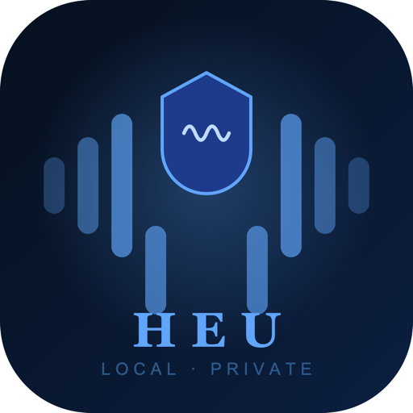

<p align="center">
  
</p>

<h1 align="center">heu</h1>

<p align="center">
  Hold <kbd>fn</kbd>, talk, let go. The words land wherever your cursor is.
</p>

<p align="center">
  
  
  
</p>

---

heu is a dictation app that lives in your menu bar. It runs Whisper locally on
your GPU, so your audio never leaves the machine — there's no account, no
server, and nothing to sign into.

It's deliberately small. The whole app is a 3.2 MB native binary; no Electron,
no bundled browser. It sits in the menu bar all day without you noticing it.

## Supported versions

| macOS | Status |
|---|---|
| 26 Tahoe | Tested — this is what heu is developed on |
| 15 Sequoia | Should work, not actively tested |
| 14 Sonoma | Minimum supported, not actively tested |
| 13 Ventura and earlier | Not supported — the app won't launch |

**Apple Silicon only.** The binary is arm64-only, so Intel Macs can't run it at
all, regardless of macOS version.

The floor is macOS 14 because that's the deployment target the app is built
against (`LSMinimumSystemVersion` in `src/Info.plist`). On macOS 13 the
installer refuses outright rather than failing at runtime. If you run heu on 14
or 15, I'd genuinely like to know whether it worked — open an issue either way.

You'll also need a whisper.cpp `ggml-*.bin` model; heu can download one for you
on first launch. Building from source additionally needs Xcode Command Line
Tools and CMake 3.16+.

## Install

heu is ad-hoc signed, not notarized — I'm not paying Apple $99/year to give
away a 3 MB app. That costs you one extra step on the download path, and
nothing at all if you build it yourself.

### Build it yourself

```sh
git clone https://github.com/ggerganov/whisper.cpp
git clone https://github.com/pirate329/heu
cd heu
cmake -B build -S .
cmake --build build -j$(sysctl -n hw.logicalcpu)
bash scripts/package.sh
cp -R dist/heu.app /Applications/
```

No Gatekeeper prompts on this path. macOS only blocks apps carrying a
`com.apple.quarantine` flag, and that flag is attached by whatever *downloaded*
the file — your browser. A binary you compiled locally never has it. You also
get to read the source first, which is rather the point of an app that claims
your audio never leaves the machine.

Takes about a minute on an M-series Mac. Needs Xcode Command Line Tools and
CMake 3.16+. The build expects whisper.cpp as a sibling of this repo, which is
what those two clones give you:

```
.
├── heu/          ← this repo
└── whisper.cpp/
```

### Or download the DMG

Grab it from [the latest release](https://github.com/pirate329/heu/releases/latest),
drag **heu** into Applications, then run:

```sh
xattr -dr com.apple.quarantine /Applications/heu.app
```

That removes the download flag your browser attached, and heu opens normally
from then on. Only do this for software you're willing to trust — in this case
the thing you're allowing is the repo you're reading.

If you'd rather not touch the Terminal: double-click heu, click **Done** on the
warning, then open **System Settings → Privacy & Security**, scroll to the
Security section, and click **Open Anyway** next to the message about heu. The
button is only offered for a short window after the failed launch, so do it
right away.

> **Note:** the old right-click → **Open** trick no longer works. Apple removed
> that bypass in macOS 15 Sequoia, so on Sequoia and Tahoe it just shows you the
> same refusal with no way through.

### First launch

heu starts with no model, so it opens Settings and offers to download one. Pick
`base.en` if you're not sure — it's 148 MB and fast enough to feel instant on
any Apple Silicon Mac.

### Permissions

macOS will ask for three things. heu needs all of them, and the second one is
the one people get stuck on:

| Permission | Why |
|---|---|
| **Microphone** | To hear you. |
| **Accessibility** | To find the focused text field and write into it. |
| **Automation** | For the Cmd+V fallback when a field won't accept direct insertion. |

If transcription works but no text appears, it's Accessibility. Open **System
Settings → Privacy & Security → Accessibility**, make sure heu is toggled on,
then **quit and relaunch heu** — macOS only re-reads that permission at
startup, so the toggle alone does nothing until you restart the app.

## Using it

Hold <kbd>fn</kbd> and speak. Release when you're done. A pill appears in the
menu bar while it's listening, and the text is inserted at your cursor a moment
after you let go.

There's also a wake word — say **"hey heu"** and it starts listening without
the keypress. Handy when your hands aren't on the keyboard.

<kbd>fn</kbd> is used because it's the one key on a Mac that isn't already
spoken for. It doesn't collide with anything in the app you're typing into.

## Models

heu reads any whisper.cpp `ggml-*.bin` from:

```
~/Library/Application Support/heu/models/
```

Settings can download them for you, or you can drop one in yourself and it'll
be picked up. Larger models are more accurate and slower:

| Model | Size | Notes |
|---|---|---|
| `ggml-tiny.en.bin` | 75 MB | Fastest, noticeably rougher |
| `ggml-base.en.bin` | 148 MB | Good default |
| `ggml-small.en.bin` | 488 MB | Better with accents and proper nouns |
| `ggml-medium.en.bin` | 1.5 GB | Slower, diminishing returns for dictation |

The `.en` variants are English-only and beat the multilingual ones of the same
size at English. Drop the suffix if you need other languages.

## Development

Build it as described in [Install](#build-it-yourself), then run it straight out
of the build directory:

```sh
./build/heu -m ~/Library/Application\ Support/heu/models/ggml-base.en.bin
```

Omit `-m` and it'll hunt for a model in the usual places. `-ng` disables Metal
if you want to compare against CPU inference.

Note that the dev binary at `build/heu` needs its own Accessibility grant —
macOS ties that permission to the executable, so the one you gave `/Applications/heu.app`
doesn't carry over.

To produce a signed app bundle and a DMG:

```sh
bash scripts/package.sh
```

## How it works

Audio comes in through miniaudio at 16 kHz mono into a ring buffer. A
background thread watches the buffer's RMS against a rolling noise floor, and
when it crosses the threshold it hands a window to whisper.cpp running on
Metal. Transcribed text goes to the Accessibility API, which writes directly
into the focused element; if that element refuses, heu falls back to putting
the text on the clipboard and sending Cmd+V.

```
src/
  App/       Entry point, Cocoa run loop, menu bar wiring
  Engine/    Audio capture, ring buffer, VAD, whisper inference
  Input/     fn key event tap, text insertion
  HUD/       Listening overlay and wave animation
  Model/     Model catalog, downloads, hot-switching
  UI/        Menu bar pill and the Settings panel
```

The only network code in the app is the model downloader in
`src/Model/ModelManager.mm`, which fetches `.bin` files from Hugging Face.
Audio is never sent anywhere — you can verify that by grepping the source for
`NSURLSession`, which turns up exactly one file.

## Troubleshooting

**Nothing happens when I hold fn.** Check Accessibility, then relaunch. The
event tap can't install without it.

**It transcribes music or background noise.** The wake-word listener runs
continuously and will try to transcribe whatever it hears. That's expected —
it only inserts text when it matches the wake word or you're holding fn.

**It won't launch on my Mac.** heu requires macOS 14 (Sonoma) and Apple
Silicon. The binary is arm64-only, so Intel Macs can't run it at all.

**Transcription is slow.** Try a smaller model, and confirm Metal is being used
— the startup log prints the GPU it picked.

## License

MIT. See [LICENSE](LICENSE).

Built on [whisper.cpp](https://github.com/ggerganov/whisper.cpp) by Georgi
Gerganov, which does the actual hard part.
